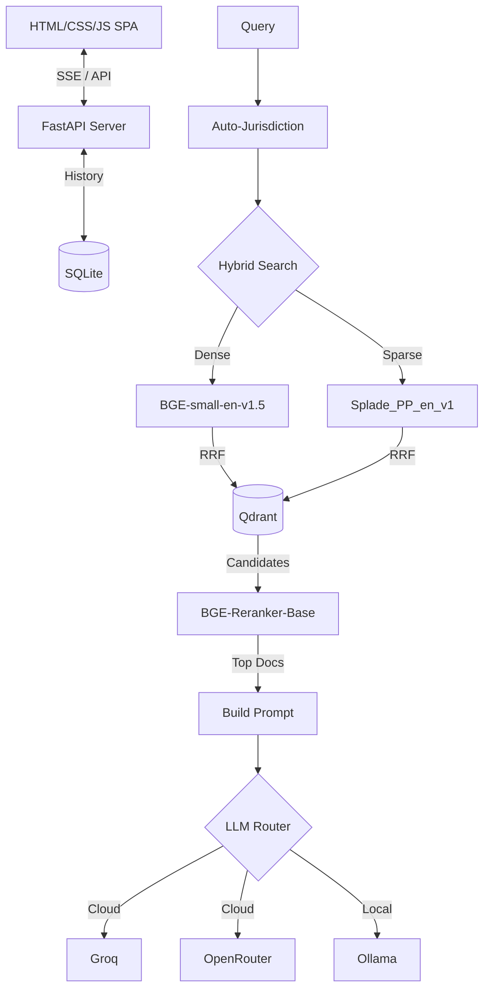

<br/>
<h1 align="center">⚖️ LexRAG — The Legal Intelligence Terminal</h1>
<p align="center">
  <strong>Enterprise-Grade Hybrid RAG for UAE & Indian Law, Taxation & Compliance</strong>
  <br/><br/>
  <a href="https://github.com/eulogik/LexRAG/stargazers"></a>
  <a href="https://github.com/eulogik/LexRAG/blob/main/LICENSE"></a>
  <a href="https://pypi.org/project/lexrag/"></a>
  <a href="https://huggingface.co/EvolucentAI/lexrag"></a>
</p>

---

## What is LexRAG?

**LexRAG** is a professional-grade, high-performance Retrieval-Augmented Generation (RAG) platform purpose-built for **UAE and Indian laws, taxation, accounting standards, and corporate compliance**. It combines hybrid dense-sparse retrieval, neural reranking, auto-jurisdiction detection, and multi-provider LLM streaming into a zero-latency terminal interface.

> ⚡ **Built by [Evolucent AI](https://evolucentai.com)** — Premium Legal Technology Solutions  
> 🛠️ **Engineered by [Eulogik](https://eulogik.com)** — Enterprise AI & Systems Integration

---

## Key Capabilities

| Capability | Technology |
|------------|------------|
| **Dense Retrieval** | `BAAI/bge-small-en-v1.5` via fastembed |
| **Sparse Retrieval** | `prithivida/Splade_PP_en_v1` via fastembed |
| **Hybrid Fusion** | Reciprocal Rank Fusion (RRF) |
| **Neural Reranker** | `BAAI/bge-reranker-base` (CrossEncoder) |
| **Vector Database** | Qdrant (on-disk, no Docker required) |
| **LLM Providers** | Groq, OpenRouter, Ollama (dynamic model catalog) |
| **Jurisdiction** | Auto-detect India/UAE/Both with manual override |
| **Confidence Tiers** | GROUNDED / PARTIAL / SYNTHESIZED |
| **Streaming** | SSE with heartbeat keep-alive |
| **Persistence** | SQLite chat history with session management |

---

## Quick Start

```bash
# Install from PyPI
pip install lexrag

# Or clone from source
git clone https://github.com/eulogik/LexRAG.git
cd LexRAG
pip install -r requirements.txt

# Configure
cp .env.example .env
# Edit .env with your API keys

# Run
python -m uvicorn api.main:app --host 0.0.0.0 --port 8000
# Open http://localhost:8000
```

---

## Architecture



---

## Ecosystem

| Platform | Link | Description |
|----------|------|-------------|
| **GitHub** | [eulogik/LexRAG](https://github.com/eulogik/LexRAG) | Source code & issues |
| **PyPI** | [lexrag](https://pypi.org/project/lexrag/) | Python package |
| **HuggingFace** | [evolucentai/lexrag](https://huggingface.co/evolucentai) | Model card |
| **Eulogik** | [eulogik.com](https://eulogik.com) | Engineering partner |
| **Evolucent AI** | [evolucentai.com](https://evolucentai.com) | Product & commercial |

---

## License

**AGPL v3** — Free for open-source and internal use.  
Commercial licenses available from [Evolucent AI](https://evolucentai.com) for proprietary deployments.

---

<div align="center">
  <sub>
    Built by <a href="https://evolucentai.com">Evolucent AI</a> — 
    Engineered by <a href="https://eulogik.com">Eulogik</a>
  </sub>
</div>
