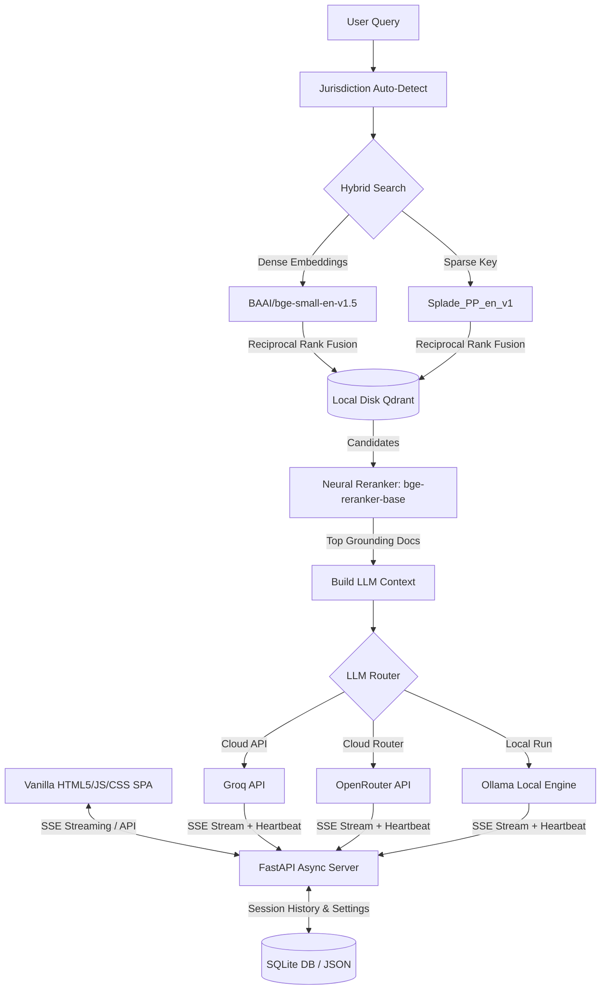

# ⚖️ LexRAG — The Legal Intelligence Terminal (v3.3.0)

LexRAG is a professional-grade, high-performance legal research and intelligence platform built by **Evolucent AI**. It provides institutional-grade research capabilities for **UAE and Indian laws, taxation, accounting standards, and corporate compliance**.

By combining modern hybrid retrieval pipelines, neural reranking, auto-jurisdiction detection, and dynamic LLM registry controls, LexRAG delivers a zero-latency, high-aesthetic Single Page Application (SPA) experience tailored for legal and tax professionals.

---

## 🚀 Key Innovations & Features

### 1. Dual-Jurisdiction Intelligence (India & UAE)
*   **Auto-Detection**: Dynamically scans input queries for country-specific legal terms (e.g., *GST, TDS, Dirham, Cabinet Decision, Section 194*) to search the correct legal corpus automatically.
*   **Hard Jurisdiction Lock**: Manually lock the query context to **India Only**, **UAE Only**, or **Always Both** via the Settings control panel.
*   **Deduplicated Source Citations**: Prevents repeated citations. Collates search results and displays unique document titles (showing the highest scoring chunk per document) linked directly to the primary sources.

### 2. Hybrid RAG Search Engine
*   **Dense Vectors**: `BAAI/bge-small-en-v1.5` via `fastembed` for deep semantic meaning.
*   **Sparse Vectors**: `prithivida/Splade_PP_en_v1` via `fastembed` for keyword precision (crucial for exact Section numbers, clause names, and statutory citations).
*   **Neural Reranking**: `BAAI/bge-reranker-base` via `CrossEncoder` to re-score hybrid search matches, placing highly relevant legal texts at the top of the LLM context.
*   **Zero Docker Native DB**: Configured using Qdrant client's native on-disk storage mode under `qdrant_storage/`. No Docker containers or external servers are required to run the vector database.

### 3. Reliable Streaming & Heartbeats
*   **Server-Sent Events (SSE)**: Delivers word-by-word streaming responses.
*   **Heartbeat Keep-Alive**: Active heartbeat signals prevent connection timeouts during long model generations or slow startup times.
*   **Think-Tag Isolation**: Intelligently parses and filters out inner reasoning tags (e.g. `<think>...</think>` from reasoning models) from the primary answer stream to keep output clean.

### 4. Grounding & Confidence Tiers
*   **Grounded Mode**: The answer is generated directly from official local legal documents.
*   **Independent Legal Analysis**: If the hybrid search score falls below the relevance threshold, LexRAG defaults to a synthesis mode. The LLM draws from its internal pre-trained knowledge base, clearly marking synthesized text block-by-block with `[INDEPENDENT ANALYSIS]` tags for transparency.

### 5. Persistent SQL Memory & Sessions
*   **Session Management**: Create new chats, rename them, or delete them in the side navigation panel.
*   **SQLite Storage**: Chat history and source metadata are persisted in `data/lexrag.db` using `sqlite-utils`, ensuring fast page loads and persistent histories across sessions.

### 6. Dynamic Settings & Model Catalog
*   **Multi-Provider LLM Integration**: Plug-and-play support for **Groq**, **OpenRouter**, and local **Ollama** models.
*   **Custom Model Registry**: Add custom model IDs directly through the settings UI. They persist in `settings.json` and become immediately selectable.
*   **Model Deletion/Toggling**: Delete obsolete custom models or toggle active models in the chat dropdown to keep the interface clean.

### 7. Premium Dark Theme Terminal
*   **Minimalist Design**: Clean UI incorporating Outfit (sans-serif) and JetBrains Mono (monospaced) typography.
*   **Context Action HUD**: Hovering over a message displays premium, low-opacity SVG ghost buttons to **Copy text**, **Edit query**, or **Retry generation** without cluttering the screen.

---

## 🏗️ Architecture



---

## 📁 Repository Structure

```text
├── api/
│   ├── main.py              # FastAPI application server, endpoints & settings routing
│   ├── rag_engine.py        # Search, Reranking, Prompt Construction, and Streaming logic
│   ├── memory.py            # SQLite database schema, sessions and history logic
│   └── utils.py             # Parser helpers (e.g. source citations)
├── ui/
│   ├── index.html           # Main terminal frontend page structure
│   ├── style.css            # Dark theme, premium layouts, and UI transitions
│   └── app.js               # Session handling, API requests, SSE streaming, and settings control
├── scripts/
│   ├── ingest.py            # De-conflicted text & PDF ingestion router
│   ├── bulk_ingest_pdfs.py  # Bulk local folder scanning and parser script
│   └── daily_update.py      # Scheduled update handler script
├── scrapers/
│   ├── india_scraper.py     # Indian Kanoon parser and scraper
│   └── uae_scraper.py       # UAE legislation and Cabinet Decisions downloader
├── data/
│   └── lexrag.db            # SQLite database file containing persistent chat history
├── qdrant_storage/          # Local on-disk Qdrant database folder
├── settings.json            # Persisted user settings, model catalog overrides, and locks
├── requirements.txt         # Project-level Python dependencies list
└── .env                     # Environmental settings and API keys (ignored by git)
```

---

## 🛠️ Quick Start

### 1. Installation
Clone the repository and install the dependencies within a virtual environment:
```bash
git clone https://github.com/gautamkishore/LexRAG.git
cd LexRAG

# Create virtual environment
python3 -m venv venv
source venv/bin/activate

# Install required dependencies
pip install -r requirements.txt
```

### 2. Configuration
Create a `.env` file in the root directory:
```env
# API Access Keys
GROQ_API_KEY=gsk_your_groq_api_key_here
OPENROUTER_API_KEY=sk-or-v1-your_openrouter_api_key_here
INDIANKANOON_TOKEN=your_indian_kanoon_token_here

# Default Server Configuration
LLM_PROVIDER=groq
HOST=0.0.0.0
PORT=8000
```

### 3. Run the Intelligence Terminal
Start the FastAPI server:
```bash
python -m uvicorn api.main:app --host 0.0.0.0 --port 8000
```
Open [http://localhost:8000](http://localhost:8000) in your web browser.

---

## 📥 Ingestion & Document Processing

LexRAG uses a **server-centric ingestion system** to prevent database locks and double-allocated GPU/CPU memory instances. When the API server is running, the ingestion scripts route incoming files through the FastAPI `/api/ingest` endpoints.

### Ingestion Methods

*   **Ingesting a Plain Text File / String**:
    Uses character-based overlapping chunks (default chunk size: 500 words, 50-word overlap) to populate the search index.
    
*   **Ingesting a PDF Document**:
    Processes files using `unstructured`'s high-resolution partitioning strategy (`strategy="hi_res"`) to parse tables, section headings, and legal text blocks into high-fidelity chunks (max chunk size: 2000 characters).

### Run Scripts

1.  **Bulk Ingest Local PDFs**:
    Place PDFs under a folder (e.g. `data/pdf/`) and run the bulk importer:
    ```bash
    python scripts/bulk_ingest_pdfs.py --dir path/to/your/pdf/folder --jurisdiction UAE
    ```

2.  **Interactive Scraper / Daily Update**:
    To scrape fresh legal updates from Indian Kanoon or UAE statutory portals:
    ```bash
    python scripts/daily_update.py
    ```

---

## 🛡️ Legal Disclaimer
LexRAG is a research assistance tool designed to help professionals locate legal articles, taxation updates, and case law. It **does not constitute formal legal or financial advice**. Always verify AI-synthesized analysis against official government gazettes and statutory documentation linked in the LexRAG citation tabs.

---
**Evolucent AI** • Premium Legal Technology Solutions.
